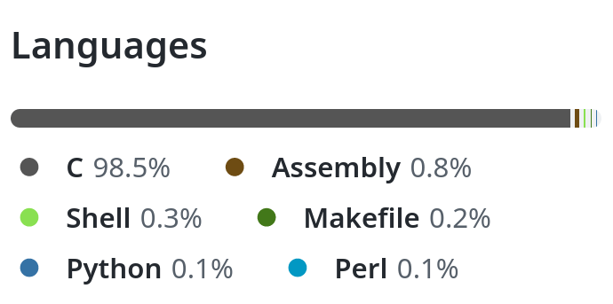
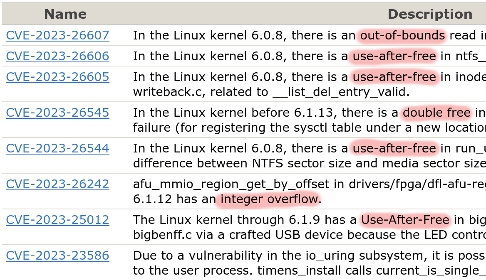

## Rust im Linux Kernel

Alexander Böhm

Chemnitzer Linux Tage

11.03.2023

---

## Zu mir

* Kein Kernel-Entwickler \
  kleine Anpassungen, Spielereien, Experimente
* Früher hauptsächlich Python, C/C++, Java
* Seit 2017 zaghafte Versuche mit Rust
* Seit 1.5y Rust auf Arbeit: Backend

---

## Adaption

---

### Stackoverflow

Developer Survey 2022:

> Rust is on its seventh year as the most loved language with 87% of developers saying they want to continue using it.

---

### Microsoft

Mark Russinovich (CTO Microsoft Azure):

> Es ist Zeit, damit aufzuhören, neue Projekte in C/C++ zu starten und stattdessen Rust für die Szenarien zu verwenden

---

### Google

Google Security Blog: Rust in Android 13

> To date, there have been zero memory safety vulnerabilities discovered in Android’s Rust code.

--- 

#### Weiter Beispiele

* GCCRS: Rust Frontend für GCC
* uutils: Reimplementierung coreutils
* rPGP: OpenPGP
* AWS Firecracker: microVM
* Servo: Browser-Engine

---

### Kernel Developer

---

#### Rust for Linux

Miguel Ojeda, Wedson Almeida Filho, Alex Gaynor:

> We believe Rust offers key improvements over C in this domain.

---

#### Asahi Linux

Asahi Lina (M1 DRM Developer):

> Rust is truly magical! [...] It really guides you towards not just safe but good design.

---

## C++ im Linux Kernel

* 2006 Diskussion über C++
* Absage von diversen Kernel Maintainern

---

### Gründe

* Komplexität durch Objekt-Orientierung
* Umgang Sprachfunktionen \
  (Exceptions, Constructor, ...)
* Unzureichende Kompilerunterstützung
* Strittige Kompatiblität mit C
* Zusatzaufwand für Kernel-Infrastruktur
* Zusätzliche Abhängigkeiten

---

## Motivation

---



*Quelle: https://github.com/torvalds/linux, (4.3.23)*

---



*Quelle: cve.mitre.org, linux kernel (4.3.23)*

---

## Infrastruktur

Voraussetzungen

* Clang

---

## Rust

---

### Geschichte

* Entstanden bei Mozilla 2009
* 1stes stabiles Release 2015
* Sichere Parallelisierung Aufgaben
* C/C++ zwar schnell, aber fehleranfällig
* Entwicklung hin zu systemnahen Use Cases

---

### Eigenschaften

* Strenge Typisierung
* Speichersicherheit ohne Garbage Collection
* Nebenläufigkeit bei Vermeidung von Race Conditions
* Zero-Cost Abstraction
* Anbindung zu C

---

### Konzepte

* Keine Objekt-Orientierung
* Traits & Generics
* Ownership für Ressourcen (Borrow-Checker)
* Lifetimes für Ressourcen (Lifetime-Checker)
* Macros
* Variable sind per default nicht veränderbar
* Markierung von unsicheren Code

---

### Stack-based Buffer Overflow

[CVE-2022-4378](https://seclists.org/oss-sec/2022/q4/178)

---

#### C

```c
int* return_freed_stack() {
    // Wert wird auf Stack alloziiert
    int value = 42; 
    // Pointer zu value auf Stack
    return &value;
    // Stack wird abgeräumt
} // Rückgabe Pointer zeigt auf abgeräumten Stack 💥
```

Führt zu Warnung im GCC

```text
warning: function returns address of local variable [-Wreturn-local-addr]
```

*Aber:* Standardmäßig kein Error, erhalte Kompilat

---

#### Rust

```rust
fn return_freed_stack() -> &i32 {
    // Variable auf dem Stack
    let value: i32 = 42;
    // Gebe Referenz auf Variable auf den Stack
    &value
    // Stack wird abgeräumt
}
```

Kompilierung scheitert:

```rust
error[E0106]: missing lifetime specifier
 --> stack-test.rs:1:24
  |
1 | fn smash_my_stack() -> &i32 {
  |                        ^ expected named lifetime parameter
  |
  = help: this function's return type contains a borrowed 
    value, but there is no value for it to be borrowed from
help: consider using the `'static` lifetime
```
---

### Use after free

* Alloziiere Speicherbereich
* Verwende Speicher
* Gebe Speicherbereich wieder frei
* Referenzen werden vergessen zu allozieren

---

#### C

```c
void do_something(int value) {
    void* buf = malloc(1024);
    if (value < 0) { free(buf); }
    memcpy(buf, &value, sizeof(value));
    return buf;
}
```

GCC kompiliert ohne Fehler/Warnungen:

---

#### Rust

```rust
fn do_something(value: i32) -> Vec<u8> {
    let mut buf = Vec::with_capacity(1024);
    if value < 0 { drop(buf); }
    buf.copy_from_slice(&value.to_be_bytes());
    return buf;
}
```

Kompilerfehler:

```rust
error[E0382]: borrow of moved value: `buf`
 --> src/main.rs:6:5
2 |     let mut buf = Vec::with_capacity(1024);
  |         ------- move occurs because `buf` has type ...
3 |     if value < 0 {
4 |         drop(buf);
  |              --- value moved here
5 |     }
6 |     buf.copy_from_slice(&value.to_be_bytes());
  |     ^^^^^^^^^^^^^^^^^^^^^^^^^^^^^^^^^^^^^^^^^
  |     value borrowed here after move
```

---

## Nachteile

### LLVM

* Rust basiert auf LLVM
* Rust Compiler in C++

---

### Zz. starke Versionsbhängigkeit 

* Meist abgestimmt auf konkrete Rust-Version

```text
*** Rust compiler 'rustc' is too new.
    This may or may not work.
***   Your version:     1.67.1
***   Expected version: 1.62.0
```

* Führt teilweise zu Fehlern mit falscher Version

```text
error: the feature `core_ffi_c` has been stable since 1.64.0
       and no longer requires an attribute to enable
```

---

## Aktueller Stand

* `async` Executor
* TCP-Server
* Synchronisations Primitive \
  (Arc, Mutex, Spinlock, CondVar)
* netfilter
* Rumpf-Implementierung für Dateisysteme

---

## Einfacher Beispiel

---

### Module definieren

```rust
use kernel::prelude::*;

module! {
    type: RustCltModule,
    name: "rust_clt_module",
    author: "Rust for Linux Contributors",
    description: "Rust Module for CLT 2023",
    license: "GPL v2",
}
```

---

### Implementierung

```rust
struct RustCltModule;

impl kernel::Module for RustCltModule {
    fn init(
        name: &'static CStr,
        _module: &'static ThisModule
    ) -> Result<Self> {
        pr_info!("Hello from kernel module {name}!");
        Ok(Self {})
    }
}
```

---

## Projekte

* GPU Treiber für M1 (Asahi Linux)
* [NVM Express Treiber](https://github.com/metaspace/linux/tree/nvme)
* [9p Server](https://github.com/wedsonaf/linux/commits/9p)

---

## Quellen/Referenzen

* https://github.com/Rust-for-Linux/linux/tree/rust/Documentation/rust
* [Google Security Blog: Memory Safe Languages in Android 13](https://security.googleblog.com/2022/12/memory-safe-languages-in-android-13.html)
* [Linus Torvalds über C++ Pushbacks](http://www.uwsg.indiana.edu/hypermail/linux/kernel/0604.3/0964.html)
* [Stackoverflow Developer Survey 2022](https://survey.stackoverflow.co/2022/)
* [LWN: A first look at Rust in the 6.1 kernel](https://lwn.net/Articles/910762/)
* [LWN: A pair of Rust kernel modules](https://lwn.net/Articles/907685/)
* [Asahi Linux: Tales of the M1 GPU](https://asahilinux.org/2022/11/tales-of-the-m1-gpu/)
