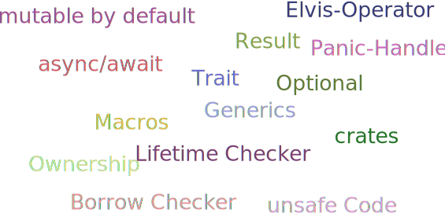
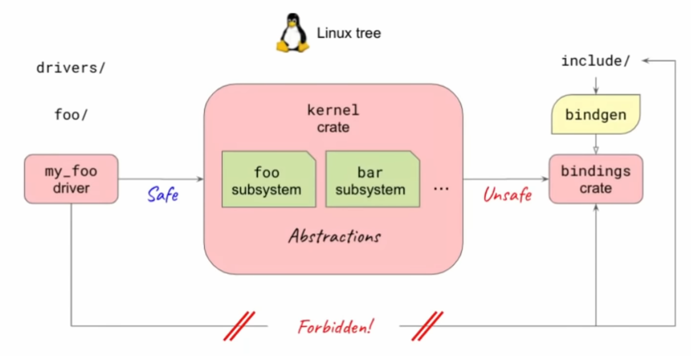
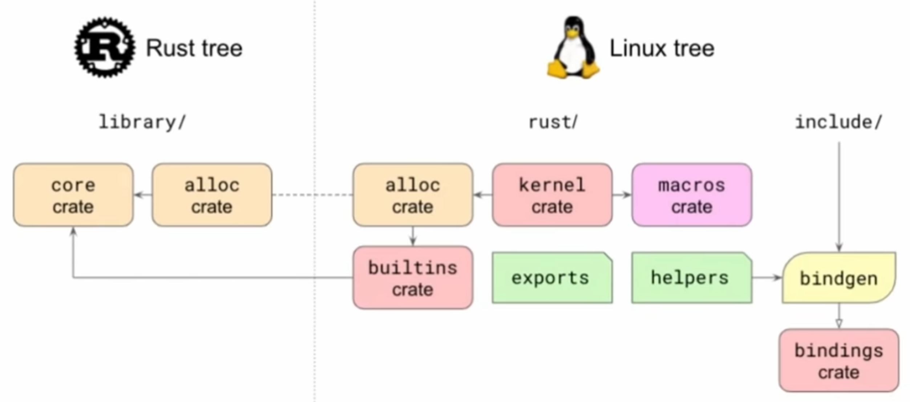
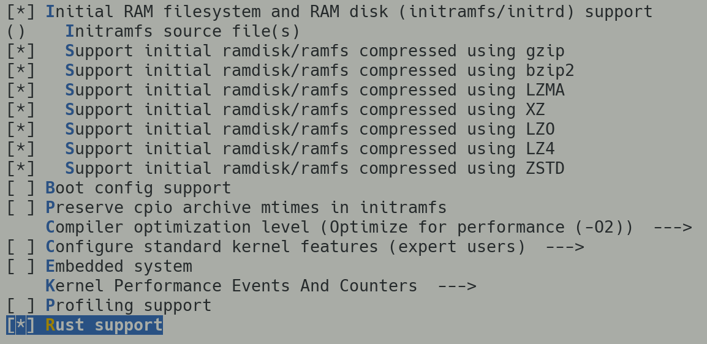
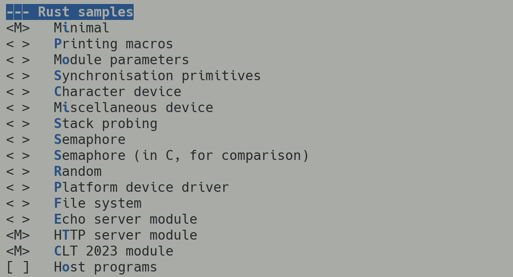

## Rust im Linux Kernel


Alexander Böhm

Chemnitzer Linux Tage, 11.03.2023

---

## Zu mir

* Kein Kernel-Entwickler \
  kleine Anpassungen & Experimente
* Python, Java, C/C++
* 2017 zaghafte Versuche mit Rust
* Seit 1.5y täglich Rust

---

## Sprachverteilung 


<small>

*Quelle: https://github.com/torvalds/linux, (4.3.23)*

</small>

---

### Neben C & Assembler

* Vereinzelte Projekte mit C++ und Ada
* Out-Of-Tree Entwicklungen
* 2006 Diskussion über C++: \
  Absage von diversen Kernel Maintainern

---

### Gründe gegen C++

* Komplexität Objekt-Orientierung
* Behandlung Sprachfunktionen? \
  Exceptions, Constructor, ...
* Unzureichende Kompilerunterstützung
* Strittige Kompatiblität mit C
* Notwendige Kernel-Infrastruktur

---

### Sicherheitsaspekte


<small>

*Quelle: cve.mitre.org, linux kernel (4.3.23)*

</small>

---

### Kernel Developer zu Rust

---

#### Rust for Linux

Miguel Ojeda, Wedson Almeida Filho, Alex Gaynor:

> We believe Rust offers key improvements over C in this domain.

---

#### Asahi Linux

Asahi Lina (M1 DRM Developer):

> Rust is truly magical! [...] It really guides you towards not just safe but good design.


---

## Rust

---

### Geschichte

* Entstanden bei Mozilla 2009: \
  C/C++ zwar schnell, aber fehleranfällig
* Einfache & sichere **Parallelisierung**
* LLVM-Kompiler
* 1. stabiles Release 2015
* systemnahe Entwicklungen

---

### Eigenschaften

* Strenge Typisierung
* Hohe Speichersicherheit
* Keine Garbage Collection
* Zero-Cost Abstraction
* Vergleichbare C/C++-Leistung
* Anbindung zu C

---

### Konzepte



---

## Verbesserungen

* Beispiel: Use after free

---

#### C

```c
// Rufe Funktion `do_something(-1)`
void* do_something(int value) {
    // Alloziiere Puffer
    void* buf = malloc(1024);
    if (value < 0) {
        free(buf);
        // Bug: return NULL vergessen
    }
    // Schreibe in Puffer
    memcpy(buf, &value, sizeof(value));
    // Gebe Pointer zurück
    return buf;
}
```

*GCC kompiliert ohne Fehler/Warnungen*

---

#### Rust

```rust
fn do_something(value: i32) -> Vec<u8> {
    // Alloziiere Puffer auf veränderlicher Variable
    let mut buf = Vec::with_capacity(1024);
    if value < 0 {
        // Gebe explizit Speicher frei
        drop(buf);
    }
    // Schreibe in Puffer
    buf.copy_from_slice(&value.to_be_bytes());
    // Gebe Pointer zurück
    return buf;
}
```

---

*Kompilerfehler*

```rust
error[E0382]: borrow of moved value: `buf`
 --> src/main.rs:6:5
2 |     let mut buf = Vec::with_capacity(1024);
  |         ------- move occurs because `buf` has type ...
3 |     if value < 0 {
4 |         drop(buf);
  |              --- value moved here
5 |     }
6 |     buf.copy_from_slice(&value.to_be_bytes());
  |     ^^^^^^^^^^^^^^^^^^^^^^^^^^^^^^^^^^^^^^^^^
  |     value borrowed here after move
```

---

*Lösung erfordert Umbau*

```rust
fn do_something(value: i32) -> Option<Vec<u8>> {
    let mut buf = Vec::with_capacity(1024);
    if value < 0 {
        buf.copy_from_slice(&value.to_be_bytes());
        // Übergebe Ownership von `buf` als Rückgabe
        Some(buf)
    } else {
        // Gebe `buf` frei, da Scope verlassen wird
        None
    }
}
```

---

## Weg in den Kernel

---

### Die Anfänge

* 2012 LLVM Linux und Clang-Support
* 2020 Linux Plumbers Conference: \
  Vorschlag zum In-Tree Support von Rust

---

### Die Idee



<small>

*Quelle: [Rust for Linux, Miguel Ojeda, Wedson Almeida Filho (März 2022)](https://www.youtube.com/watch?v=fVEeqo40IyQ&list=PL85XCvVPmGQgL3lqQD5ivLNLfdAdxbE_u)*

</small>

---

### 6.1 LTS Kernel

* Mitte Dezember 2022
* Minimales Kernelmodul
* Infrastruktur

---



<small>

*Quelle: [Rust for Linux, Miguel Ojeda, Wedson Almeida Filho (März 2022)](https://www.youtube.com/watch?v=fVEeqo40IyQ&list=PL85XCvVPmGQgL3lqQD5ivLNLfdAdxbE_u)*

</small>

---

### 6.2er Kernel

* Mitte Feburar 2023
* String-Behandlung
* Formater
* VTables-Unterstützung

---

### Aktuelle Entwicklungen

* netfilter
* Moduleparameter
* Dateisystemanbindung
* TCP-Server
* Einfache Treiber (Char/Misc Device)
* Asynchronous Resource Counter
* Synchronisationsprimitive (Mutex, Semaphore)

---

## Erstes Kernelmodul

---

### Vorbereitung

* Rust Abhängigkeiten

```sh
rustup override set 1.62.0
rustup component add rust-src
cargo install --locked --version 0.56.0 bindgen
```

* LLVM/Clang Abhängigkeiten

```
apt-get install -y clang-11 lld-11 llvm-11
```

---

### ⚠️  Starke Versionsbhängigkeit ⚠️ 

* Meist abgestimmt auf konkrete Rust-Version

```text
*** Rust compiler 'rustc' is too new.
    This may or may not work.
***   Your version:     1.67.1
***   Expected version: 1.62.0
```

* Führt teilweise zu Fehlern

```text
error: the feature `core_ffi_c` has been stable since 1.64.0
       and no longer requires an attribute to enable
```

---

### Rust Support aktivieren



---

### Beispiele aktivieren



---

### Modul definieren

```rust
// SPDX-License-Identifier: GPL-2.0
//! Rust module for CLT 2023
use kernel::prelude::*;

module! {
    type: RustCltModule,
    name: "rust_clt_module",
    author: "Alexander Böhm",
    description: "Rust Module for CLT 2023",
    license: "GPL v2",
}

struct RustCltModule { name: &'static CStr }
```

---

### Initialisierung implementieren

```rust
impl kernel::Module for RustCltModule {
    fn init(
        name: &'static CStr,
        _module: &'static ThisModule
    ) -> Result<Self> {
        pr_info!("Hello CLT 2023 from kernel module {name}!");
        Ok(Self { name })
    }
}
```

---

### Unloading implementieren

```rust
impl Drop for RustCltModule {
    fn drop(&mut self) {
        pr_info!("Goodbye from kernel module {}!",
                 self.name);
    }
}
```

---

### Kernel bauen

```
make LLVM=1 bzImage modules
```

---

### Modul ausprobieren

```
[    1.023889] rust_clt_module: Hello CLT 2023 from kernel 
               module rust_clt_module!
[    1.025889] rust_clt_module: Goodbye from kernel module
               rust_clt_module!
```

---

## Aussicht & TODOs

---

### Kernel

* Keine Reimplementierung
* Weitere Abstraktionen für Subsysteme
* Testing
* Tooling & Infrastruktur
* Offene Fragen bzgl. Distribution
* Weitere Architekturen (aarch64)

---

#### Aussichtsreiche Module

* Android IPC Binder
* [GPU Treiber für M1 (Asahi Linux)](https://asahilinux.org)
* [NVM Express Treiber](https://github.com/metaspace/linux/tree/nvme)
* [9p Server](https://github.com/wedsonaf/linux/commits/9p)

---

### Für Rust

* Abstimmung
* Eigene Primitive (bspw. `Arc`)
* Kompiler-Anpassung

---

### GCCRS


* Frontend für GCC
* Erste experimentele Version \
  für GCC 13.1
* 2023:  Test Suite v1.49 bestehen
* Kein Borrow-Checker
* Ermöglicht mehr Architekturen
* Zugriff auf GCC-Tooling

---

## Fazit

* Rust ist im Kernel angelangt
* Schnelle Entwicklung
* Potentiale für sicheren Code
* Zahlreiche offene Themen

<small>
<br/>
<br/>
<br/>

Folien & Beispiele:
[https://github.com/aboehm/CLT2023-rust-im-linux-kernel](aboehm/CLT2023-rust-im-linux-kernel)

</small>

---

## Quellen/Referenzen

* [Rust For Linux](https://github.com/Rust-for-Linux/linux/tree/rust/Documentation/rust)
* [LKML: Vorschlag für Unterstützung von "in-tree" Rust Support](https://lore.kernel.org/lkml/CAKwvOdmuYc8rW_H4aQG4DsJzho=F+djd68fp7mzmBp3-wY--Uw@mail.gmail.com/T/#u)
* [Google Security Blog: Memory Safe Languages in Android 13](https://security.googleblog.com/2022/12/memory-safe-languages-in-android-13.html)
* [Linus Torvalds über C++ Pushbacks](http://www.uwsg.indiana.edu/hypermail/linux/kernel/0604.3/0964.html)
* [Stackoverflow Developer Survey 2022](https://survey.stackoverflow.co/2022/)
* [LWN: A first look at Rust in the 6.1 kernel](https://lwn.net/Articles/910762/)
* [LWN: A pair of Rust kernel modules](https://lwn.net/Articles/907685/)
* [Asahi Linux: Tales of the M1 GPU](https://asahilinux.org/2022/11/tales-of-the-m1-gpu/)
* [How Rust supports the Linux Kernel](https://www.youtube.com/watch?v=1R6CxuUwA7E)
* [Rust for Linux by Miguel Ojeda and Wedson Almeida Filho - Rust Linz, March 2022](https://www.youtube.com/watch?v=fVEeqo40IyQ)
* [Rust for Linux: Status and Wishlist](https://www.youtube.com/watch?v=fVEeqo40IyQ&list=PL85XCvVPmGQgL3lqQD5ivLNLfdAdxbE_u)
* [Rust for Linux, Rust CTCFT 2021](https://rust-lang.github.io/ctcft/slides/2021-11-22_-_Rust_CTCFT_-_Rust_for_Linux.pdf)
* [Heise: Three Questions and Answers: Rust for Linux](https://www.heise.de/hintergrund/Three-Questions-and-Answers-Rust-for-Linux-7532262.html)
* [GCCRS Kompiler](https://github.com/Rust-GCC/gccrs)
